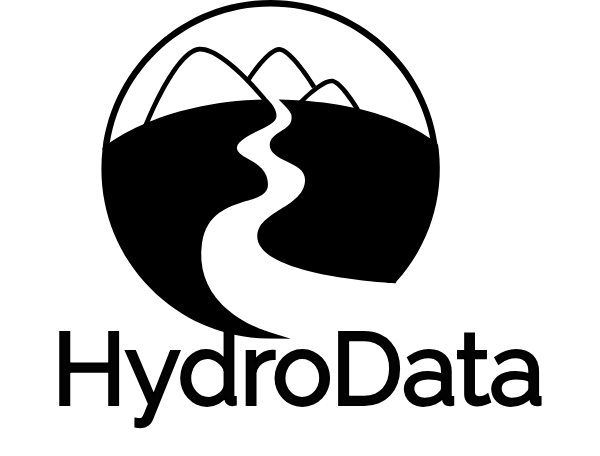
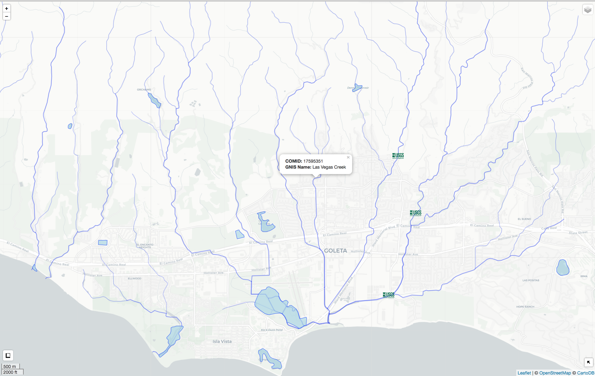

# HydroData: Earth Systems Data in R 

[](http://travis-ci.org/mikejohnson51/HydroData) [](https://coveralls.io/github/mikejohnson51/HydroData?branch=master) [](https://zenodo.org/badge/latestdoi/112221493)

**HydroData** is designed to help (1) find, (2) get, (3) visualize, and (4) format disparate earth systems data through a core language (R); a common geospatial reference (ESPG:4629) ; and unifying vocabulary built around querying data by an area of interest (AOI). The package supports access to 20+ National/Global data sources. 

All functions are designed to work with the [AOI](https://mikejohnson51.github.io/AOI/) package and magrittr pipe operation `%>%` allowing successive HydroData calls to be directly chained to an area of interest:

```r
myData = getAOI(clip = list("UCSB", 10, 10)) %>% 
findNHD() %>% 
findWaterbodies %>% 
findNWIS %>% 
findNED()
```
```
str(myData,max.level = 2)

List of 5
 $ AOI        :Formal class 'SpatialPolygons' [package "sp"] with 4 slots
 $ nhd        :Formal class 'SpatialLinesDataFrame' [package "sp"] with 4 slots
 $ waterbodies:Formal class 'SpatialPolygonsDataFrame' [package "sp"] with 5 slots
 $ nwis       :Formal class 'SpatialPointsDataFrame' [package "sp"] with 5 slots
 $ NED        :Formal class 'RasterLayer' [package "raster"] with 12 slots
 - attr(*, "class")= chr "HydroData"
```

For now, most internal HydroData operations are based of the 'simple feature (sf)' library however objects are all returned as Spatial* sp objects. As the community around simple features grows the default output of 'HydroData' might change. Until then users can use the `to_sf` function to convert a `HydroData` object to simple features where appropriate.

HydroData offer in-package tools for generating interactive visualizations of HydroData Spatial* objects

```r
myData.sf = myData %>% to_sf
```
```
str(myData.sf,max.level = 1)

List of 5
 $ NED        :Formal class 'RasterLayer' [package "raster"] with 12 slots
 $ AOI        :Classes ‘sf’ and 'data.frame':	1 obs. of  1 variable:
  ..- attr(*, "sf_column")= chr "geometry"
  ..- attr(*, "agr")= Factor w/ 3 levels "constant","aggregate",..: 
  .. ..- attr(*, "names")= chr(0) 
 $ nhd        :Classes ‘sf’ and 'data.frame':	100 obs. of  92 variables:
  ..- attr(*, "sf_column")= chr "geometry"
  ..- attr(*, "agr")= Factor w/ 3 levels "constant","aggregate",..: NA NA NA NA NA NA NA NA NA NA ...
  .. ..- attr(*, "names")= chr [1:91] "id" "ogc_fid" "comid" "fdate" ...
 $ waterbodies:Classes ‘sf’ and 'data.frame':	11 obs. of  24 variables:
  ..- attr(*, "sf_column")= chr "geometry"
  ..- attr(*, "agr")= Factor w/ 3 levels "constant","aggregate",..: NA NA NA NA NA NA NA NA NA NA ...
  .. ..- attr(*, "names")= chr [1:23] "id" "objectid" "comid" "fdate" ...
 $ nwis       :Classes ‘sf’ and 'data.frame':	3 obs. of  8 variables:
  ..- attr(*, "sf_column")= chr "geometry"
  ..- attr(*, "agr")= Factor w/ 3 levels "constant","aggregate",..: NA NA NA NA NA NA NA
  .. ..- attr(*, "names")= chr [1:7] "OBJECTID" "feature_id" "site_no" "site_name" ...
  
```
HydroData offer in-package tools for generating interactive visualizations of HydroData Spatial* objects

```r
 myData %>% explore()

```
<br>

<br>

To download and get started with HydroData, install from GitHub using the `devtools` packages:

```r
library(devtools)
install_github("mikejohnson51/HydroData")
```

### Support:

HydroData is written by [Mike Johnson](https://mikejohnson51.github.io), a graduate Student at the [University of California, Santa Barbara](https://geog.ucsb.edu) in [Keith C. Clarke's](http://www.geog.ucsb.edu/~kclarke/) Lab, 2018 and is funded through the NOAA National Water Center (NWC) via the UCAR COMET Program (2017/18).


