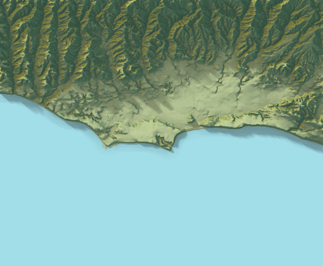

#HydroData: Earth Systems Data in R 

[](https://travis-ci.org/mikejohnson51/HydroData) [](https://coveralls.io/github/mikejohnson51/HydroData?branch=master)

**HydroData** is designed to help (1) find, (2) get, (3) visualize and (4) format disparate earth systems data through a core language (R); a common geospatial reference; and unifying vocabulary built around querying data for an area of interest (AOI). The package supports access to 19 National/Global data sources. 

All functions are dsigned to work with the [AOI](https://mikejohnson51.github.io/AOI/) package and with the magrittr pipe operation `%>%`. This way HydroData calls can be directly chained to the area of interest:

```r
myData = getAOI(clip = list("UCSB", 10, 10)) %>% 
findNHD() %>% 
findWaterbodies %>% 
findNWIS %>% 
findNED()
```
```
str(myData,max.level = 2)

List of 5
 $ AOI        :Formal class 'SpatialPolygons' [package "sp"] with 4 slots
 $ nhd        :Formal class 'SpatialLinesDataFrame' [package "sp"] with 4 slots
 $ waterbodies:Formal class 'SpatialPolygonsDataFrame' [package "sp"] with 5 slots
 $ nwis       :Formal class 'SpatialPointsDataFrame' [package "sp"] with 5 slots
 $ NED        :Formal class 'RasterLayer' [package "raster"] with 12 slots
 - attr(*, "class")= chr "HydroData"

```

HydroData offer in-package tools for generating interactive visualizations of HydroData Spatial* objects

```r
 myData %>% explore()

```
<br>

<br>

The data can be ploted piecemeal:

```r

raster::plot(myData$NED, col = col_elev, main = "UCSB HydroData")
sp::plot(myData$nhd, add =T, col = "ghostwhite", lwd = myData$nhd$streamorde)
sp::plot(myData$waterbodies, add =T, col = 'ghostwhite')

```
<br>

<br>

and for fun the NED file can be passed though the rayshaer package to generate a beautiful hillshade image

```r
library(rayshader)

ned = myData$NED
ned = matrix(raster::extract(ned,raster::extent(ned),buffer=1000),
             nrow=ncol(ned),ncol=nrow(ned))
             
ned %>% sphere_shade(texture = "imhof1") %>%
  add_water(detect_water(ned), color="desert") %>%
  add_shadow(ray_shade(ned)) %>%
  add_shadow(ambient_shade(ned)) %>%
  plot_map()
  
```
<br>

<br>

To download and get started with HydroData, install from GitHub using the `devtools` packages:

```r
library(devtools)
install_github("mikejohnson51/HydroData")
```

